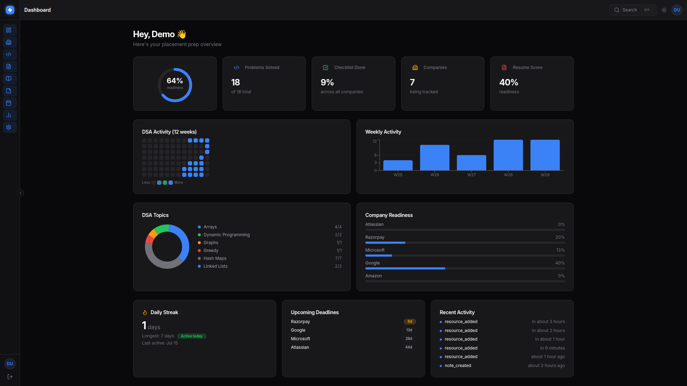
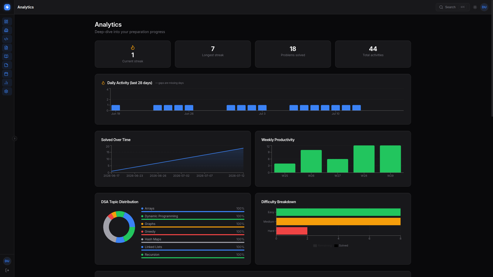

# OfferForge

A professional placement preparation hub — DSA tracking, company checklists, resume management, calendar milestones, and real-time analytics, unified in a single dashboard.

---

## Screenshots

| Desktop Dashboard |
|:-:|
|  |

 Analytics |
:-:|
 |

---

## Features

- **Dashboard** — Readiness score, GitHub-style heatmap, weekly activity chart, company progress, streak tracking
- **DSA Tracker** — Problem library with filters, tags, difficulty badges, revision status, and stats
- **Companies** — Track applications, deadlines, company-specific checklists, cluster filters (FAANG, Product, etc.)
- **Resumes** — PDF upload, active-resume management, and evidence-based Gemini job-description matching
- **Calendar** — Milestone and deadline overview
- **Analytics** — Cross-section breakdowns and trends
- **Notes & Resources** — Personal notes and link collections
- **Settings** — Profile and preferences
- **Command Palette** — Press `⌘K` / `Ctrl+K` to search across companies, problems, notes, and resources instantly

### Mobile Navigation

OfferForge uses a bottom tab bar on phones (5 primary tabs + a **More** grid page for remaining sections), avoiding overlay drawers that block content.

---

## Tech Stack

| Layer | Technology |
| :--- | :--- |
| **Frontend** | React 19, TypeScript, Vite, TailwindCSS v4, Recharts, TanStack Query, Lucide Icons |
| **Backend** | FastAPI, Python 3.11, SQLAlchemy 2.0 (async), Alembic, Pydantic v2, Google OAuth, Gemini API |
| **Database** | PostgreSQL 16 (asyncpg) |
| **Storage** | PostgreSQL (resume PDFs and analysis history) |

---

## Quickstart

```bash
# 1. Configure environment
cp backend/.env.example backend/.env
# Edit backend/.env with your secrets (JWT, Google OAuth, Gemini)

# 2. Launch everything
docker compose up --build
```

| Service | URL |
| :--- | :--- |
| Frontend | http://localhost:5173 |
| Backend API | http://localhost:8000 |
| API Docs | http://localhost:8000/docs |

### Gemini job matching

Add a Google AI Studio key to `backend/.env` (or the backend host's secret
environment variables). The key is used only by FastAPI and must never be
placed in a `VITE_*` frontend variable.

```env
GEMINI_API_KEY=your_complete_key
GEMINI_MODEL=gemini-3.7-flash
GEMINI_FALLBACK_MODEL=gemini-3.5-flash
```

After a resume is uploaded, paste a job description to receive an estimated
match percentage, category breakdown, cited resume evidence, gaps, and
prioritized improvements. The percentage measures documented alignment with
the supplied job description; it is not a hiring-probability prediction.

---

## Project Structure

```
frontend/
├── src/
│   ├── components/
│   │   ├── layout/    # AppLayout, Topbar, Sidebar (desktop), CommandPalette
│   │   ├── ui/        # shadcn-inspired primitives
│   │   └── shared/    # EmptyState, AuthCard, ProtectedRoute
│   ├── pages/         # Dashboard, Companies, DSA, Notes, More, …
│   ├── api/           # API client modules
│   ├── context/       # Auth, Theme
│   └── lib/           # Utilities, chart theme
├── backend/
│   ├── app/
│   │   ├── api/       # Route definitions
│   │   ├── core/      # Config, security, dependencies
│   │   ├── models/    # SQLAlchemy models
│   │   └── schemas/   # Pydantic schemas
│   └── alembic/       # Migrations
```

---

## License

[MIT](LICENSE)
